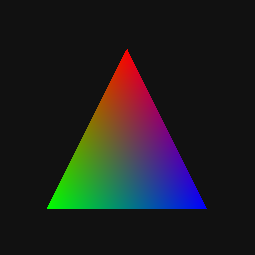

<div align="center">
  <h1>Black</h1>
  <p>A software rasterizer for Rust</p>
  
</div>

## Overview

Black is a small software rasterizer for Rust. It allows one to create simple 3D visualizations that are run entirely on the CPU. It provides a fairly low level graphics API specifically geared towards triangle rasterization and allows for custom vertex and fragment shaders to be implemented with Rust traits.

This project was primarily written as an exercise in Rust. It is offered to anyone who finds it of use.

## Building

This project was built against `rustc 1.39.0-nightly (6ef275e6c 2019-09-24)`. The crate being used to present the window is the `mini-fb` crate. If building on Windows, you will need `Windows C++ build tools`. Once installed, just run the following from the project root to start the example project.

```bash
$ cargo run --release
```

## Example

The following code renders single RGB triangle. Note that the `Varying` type must implement `Interpolate` which performs perspective correct per fragment interpolation across the triangle.

Note the implementation of `TargetBuffer` which is used to receive fragment shader output. If this code was output to a window, or other output device, this code will result in the image below. 

> Refer to the example project in this repository for an implementation of `TargetBuffer`. It is leveraging the most excellent [mini_fb](https://github.com/emoon/rust_minifb) crate. This should work on Windows, Mac and Linux.




```rust
#[macro_use] extern crate black;

use black::{ TargetBuffer, DepthBuffer, Raster, Interpolate, VertexProgram, FragmentProgram };
use black::{ Vec4, Vec3, Mat4 };

// ----------------------------------------------
// Uniform, Vertex and Varying types
// ----------------------------------------------

struct Uniform {
    projection: Mat4,
    matrix:     Mat4,
    view:       Mat4
}
struct Vertex {
    position: Vec4,
    color:    Vec3
}
#[derive(Interpolate)]
struct Varying {
    position: Vec4,
    color:    Vec3
}

// ----------------------------------------------
// VertexProgram
// ----------------------------------------------

struct VertexShader; 
impl VertexProgram for VertexShader {
    type Uniform = Uniform;
    type Varying = Varying;
    type Vertex  = Vertex;

    fn main(&self, uniform: &Uniform, vertex: &Vertex, varying: &mut Varying) -> Vec4 {
        // assign varying to be interpolated across this primitive.
        varying.position = vertex.position;
        varying.color    = vertex.color
        
        // transform the vertex (analogous to gl_Position transform)
        input.position * (uniform.matrix * (uniform.view * uniform.projection))
    }
}

// -----------------------------------------
// FragmentProgram
// -----------------------------------------

struct FragmentShader; 
impl FragmentProgram for FragmentShader {
    type Uniform = Uniform;
    type Varying = Varying;

    fn main(&self, uniform: &Uniform, varying: &Varying) -> Vec4 {
        Vec4::new(
            varying.color.x, 
            varying.color.y, 
            varying.color.z, 
            1.0)
    }
}

// -----------------------------------------
// TargetBuffer
// -----------------------------------------

struct ColorBuffer; 
impl TargetBuffer for ColorBuffer {
    fn width (&self) -> usize { 256 }
    fn height(&self) -> usize { 256 }
    fn set(&mut self, x: usize, y: usize, color: Vec4) {
        // Invoked per fragment. Take vec4 output from fragment
        // shader and write to output device or other buffer.
    }
}

fn main() {
    
    // Color and Depth buffers.
    let mut color_buffer = ColorBuffer;
    let mut depth_buffer = DepthBuffer::new(256, 256);

    // Sets up the uniforms for this draw. Works
    // in a similar fashion to GLSL uniforms.
    let uniform = Uniform {
        projection: Mat4::perspective_fov(90.0, 1.0, 0.1, 1000.0),
        matrix:     Mat4::identity(),
        view:       Mat4::look_at(
            &Vec3::new(0.0, 0.0, 3.0),
            &Vec3::new(0.0, 0.0, 0.0),
            &Vec3::new(0.0, 1.0, 0.0),
        ),
    }

    // Rasterizes this triangle into the given
    // OutputBuffer. Depth values stored in the
    // given depth_buffer.
    Raster::triangle(
        &VertexShader,
        &FragmentShader,
        &mut depth_buffer,
        &mut color_buffer,
        &uniform,
        &Vertex { 
            position: Vec4::new(0.0, 1.0, 0.0, 1.0),
            color:    Vec3::new(1.0, 0.0, 0.0),
        },
        &Vertex {
            position: Vec4::new(-1.0, -1.0, 0.0, 1.0),
            color:    Vec3::new(0.0, 1.0, 0.0),
        },
        &Vertex { 
            position: Vec4::new(1.0, -1.0, 0.0, 1.0),
            color:    Vec3::new(0.0, 0.0, 1.0),
        } 
    );
}
```
